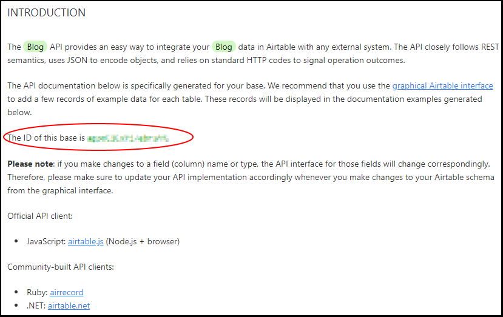
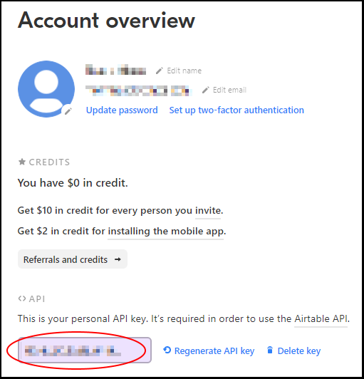

# Airtable Blog

A blog using Airtable as the datastore.

## Installation

Create a new base on [Airtable](https://airtable.com/).

Create a new table inside that base called `posts`. The table should have four
fields:

1. `id` - autonumber
2. `title` - single line text
3. `content` - long text
4. `publishedAt` - date with time included

While in your base, click **Help** > **API documentation**. Record the base ID. You'll need it in a moment.
It will be in the **INTRODUCTION** section.

Go to your [Account overview](https://airtable.com/account) and look in the
**API** section. Record your personal API key. You'll need it in a moment.

Click the button below.

Follow the deploy instructions on screen. It will ask for the base ID and API
key you recorded earlier.

## Usage

Go to the URL Netlify created for your site. The homepage contains any blog
posts you've entered on the `posts` table on Airtable.

## To Do

- Admin authentication
- Create, update, and delete posts through this project instead of Airtable UI.
- Single post view
- Add style to site

## License

The MIT License

Copyright 2019 Travis Horn

Permission is hereby granted, free of charge, to any person obtaining a copy of
this software and associated documentation files (the "Software"), to deal in
the Software without restriction, including without limitation the rights to
use, copy, modify, merge, publish, distribute, sublicense, and/or sell copies of
the Software, and to permit persons to whom the Software is furnished to do so,
subject to the following conditions:

The above copyright notice and this permission notice shall be included in all
copies or substantial portions of the Software.

THE SOFTWARE IS PROVIDED "AS IS", WITHOUT WARRANTY OF ANY KIND, EXPRESS OR
IMPLIED, INCLUDING BUT NOT LIMITED TO THE WARRANTIES OF MERCHANTABILITY, FITNESS
FOR A PARTICULAR PURPOSE AND NONINFRINGEMENT. IN NO EVENT SHALL THE AUTHORS OR
COPYRIGHT HOLDERS BE LIABLE FOR ANY CLAIM, DAMAGES OR OTHER LIABILITY, WHETHER
IN AN ACTION OF CONTRACT, TORT OR OTHERWISE, ARISING FROM, OUT OF OR IN
CONNECTION WITH THE SOFTWARE OR THE USE OR OTHER DEALINGS IN THE SOFTWARE.
